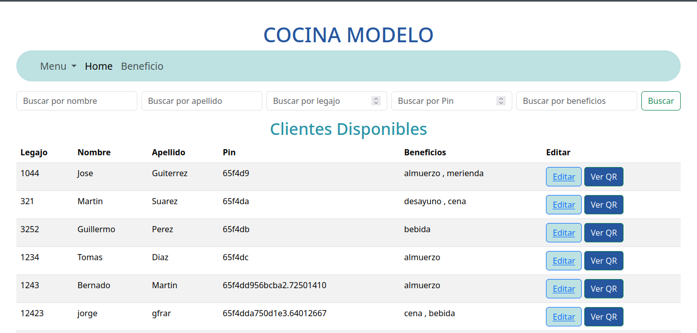
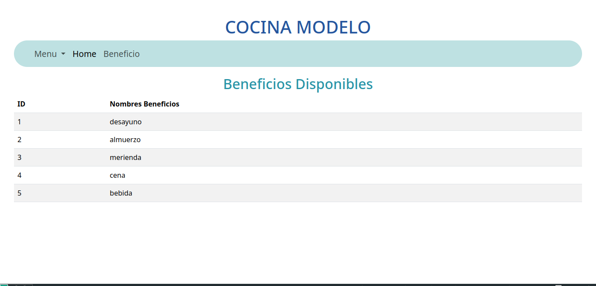
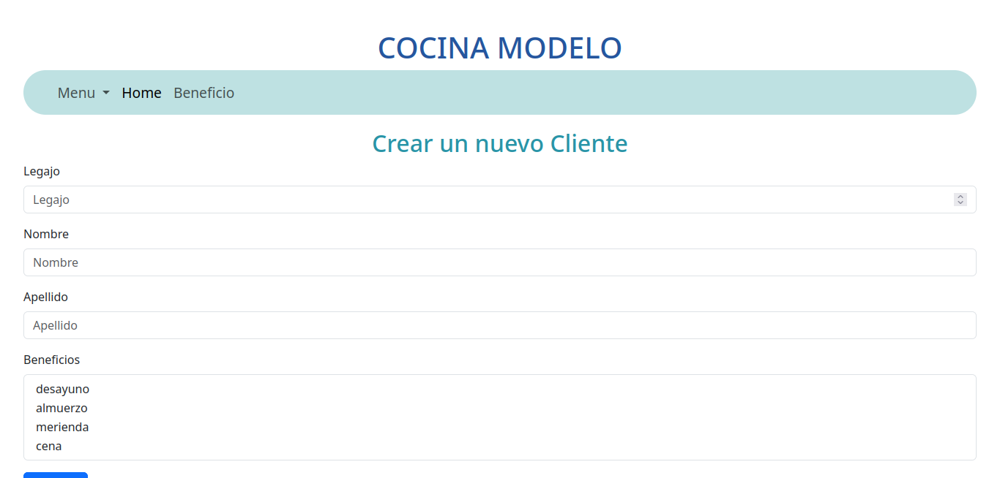
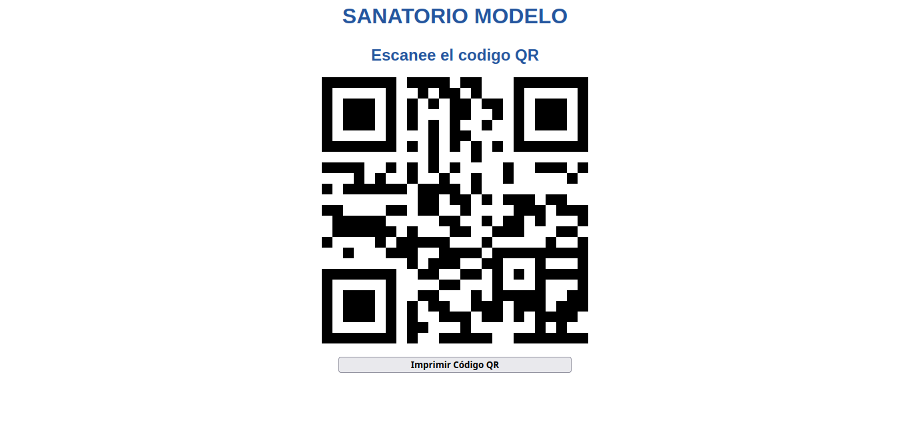
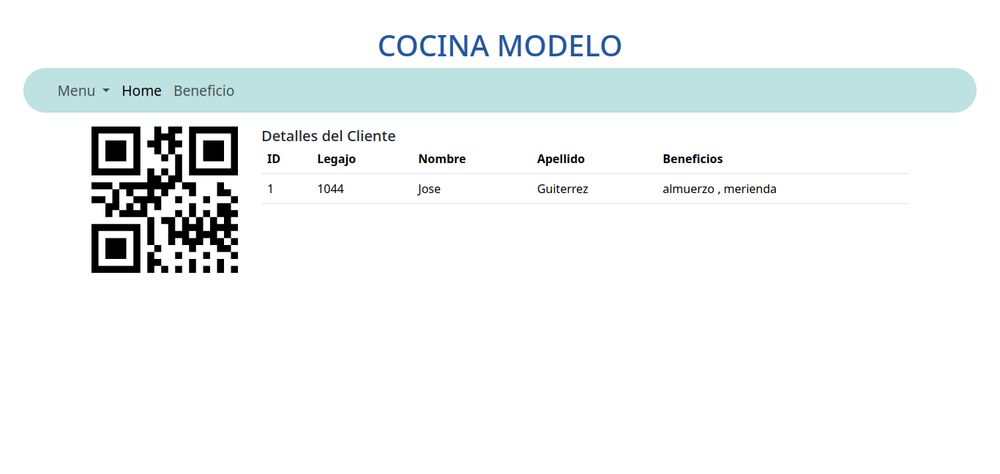

# Proyecto QR 
***

## ¿De qué trata?
Este proyecto aplicado en una cocina de un sanatorio tiene como funcionalidad que cada usuario/cliente pueda ver que beneficio ( de la cocina) tiene disponible. En la home verán una planilla donde se puede ver y editar los atributos de cada usuario.


Tambien habrá vistas que tendrán a disposición:
 



En la home tendrá un botón "Ver Qr" donde podemos visualizar, imprimir y guardar el QR de dicho usuario.
 

Dicho QR si lo escaneamos nos lanzará un link donde tendrá a detalle la información de nuestro cliente/usuario.

***

## ¿Cómo instalarlo?
### Requirimientos
- Tener instalado composer:
```
php -r "copy('https://getcomposer.org/installer', 'composer-setup.php');"
php -r "if (hash_file('sha384', 'composer-setup.php') === 'dac665fdc30fdd8ec78b38b9800061b4150413ff2e3b6f88543c636f7cd84f6db9189d43a81e5503cda447da73c7e5b6') { echo 'Installer verified'; } else { echo 'Installer corrupt'; unlink('composer-setup.php'); } echo PHP_EOL;"
php composer-setup.php
php -r "unlink('composer-setup.php');"
```
- Instalar Laravel:```composer global require laravel/installer```
- Clonar el repositorio:```git clone https://github.com/pablojwittich/php_proyects.git```
- Ir a la carpeta php_proyects/modeloCocina/ e instalar las dependencias, que en este caso son para poder realizar el QR: ```composer require simplesoftwareio/simple-qrcode```
- Iniciar el proyecto. A los usuarios de linux Les dejo al principio de la carpeta un bash que inicia httpd y mysql, muestra el estado y por ultimo inicia el servidor de laravel. Para correrlo se tienen que posicionar el la carpeta php_proyects/ y ejecutar el comando ```sudo bash startCocinaModelo.sh```
- Listo. 
