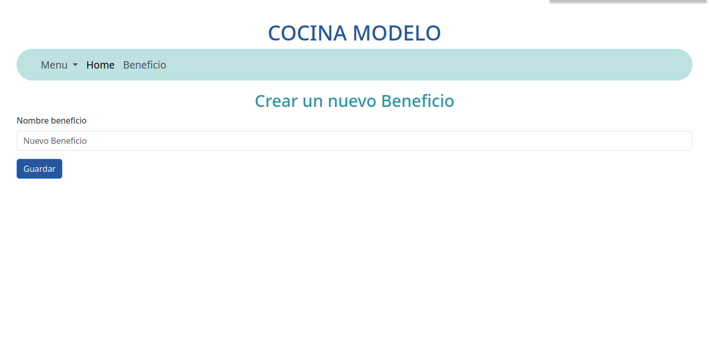

# Proyecto QR 
Este proyecto aplicado en una cocina de un sanatorio tiene como funcionalidad que cada usuario/cliente pueda ver que beneficio ( de la cocina) tiene disponible. En la home verán una planilla donde se puede ver y editar los atributos de cada usuario.

Tambien habrá vistas que tendrán a disposición:
 

En la home tendrá un botón "Ver Qr" donde podemos visualizar, imprimir y guardar el QR de dicho usuario.
 
Dicho QR si lo escaneamos nos lanzará un link donde tendrá a detalle la información de nuestro cliente/usuario.

